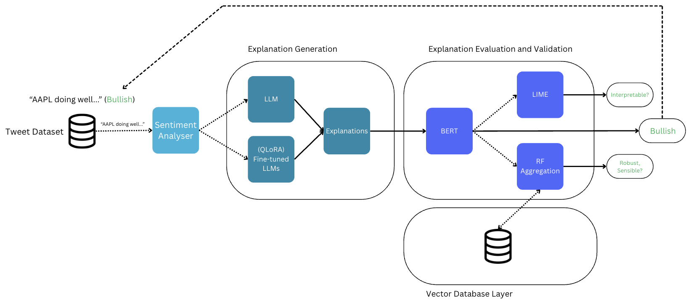

# Explainable Stock Market Sentiment Analysis
(N.B. This is code for my dissertation as part of module CM30082 at the University of Bath.)

# Abstract
We present a novel approach to using explanations generated by open-source Large Language Models (LLMs) as first-class features in sentiment analysis of financial tweets, motivated by the regulatory and ethical need for transparency and explainability in financial decisions. We compare the predictive capabilities of different LLMs by fine-tuning BERT on the explanations generated and explore the extent to which parameter-efficient fine-tuning can improve performance. We investigate the interpretability and validity of these explanations quantitatively through LIME and Random Forest classifiers, and qualitatively through visual inspection. We also demonstrate how the versatility of vector databases as a tool for analysts helps with financial forecasting and supports auditing. Our findings show that explanations from models like Mistral 7B and DeepSeek R1 (Distilled versions) show strong interpretability and when used as features for financial sentiment analysis show considerable improvement over baseline approaches.

# High Level Implementation

## Dataset
https://www.kaggle.com/datasets/yash612/stockmarket-sentiment-dataset

## Pipeline

# Results
### Aggregated Metrics per Model
*(Ordered by F1 Score; Best results are boldfaced. (Input) indicates the input tweet was included during fine-tuning.)*

| Model                                         | Accuracy  | Precision | Recall   | F1        |
|----------------------------------------------|-----------|-----------|----------|-----------|
| Baseline - Random Forest                     | 0.760704  | 0.757355  | 0.760704 | 0.758374  |
| Baseline - BERT (Input)                      | 0.766920  | 0.767067  | 0.766920 | 0.766993  |
| Baseline - FinBERT                           | 0.790308  | 0.797588  | 0.790308 | 0.791721  |
| Mistral 7B (Sentiment)                       | 0.806285  | 0.803683  | 0.806285 | 0.802166  |
| DeepSeek R1 (Distill LLaMA 8B)               | 0.807320  | 0.807652  | 0.807320 | 0.807480  |
| Mistral 7B                                   | 0.821478  | 0.824485  | 0.821478 | 0.813964  |
| Mistral 7B (Input)                           | 0.826312  | 0.824876  | 0.826312 | 0.822454  |
| DeepSeek R1 (Distill LLaMA 8B) (Input)       | 0.828038  | 0.826099  | 0.828038 | 0.825295  |
| Mistral 7B (FT, Dynamic Prompt)              | 0.827693  | 0.825909  | 0.827693 | 0.826237  |
| Mistral 7B (Finetuned)                       | 0.830110  | 0.828728  | 0.830110 | 0.826525  |
| DeepSeek R1 (Distill Qwen 32B) (Input)       | 0.829419  | 0.827591  | 0.829419 | 0.827825  |
| DeepSeek R1 (Distill Qwen 32B)               | 0.829765  | 0.827954  | 0.829765 | 0.828196  |
| **GPT4oMini**                                | **0.839434** | **0.841862** | **0.839434** | **0.833863** |

While GPT4oMini achieves the highest scores across all metrics, with an F1 score of 0.834, we
consider DeepSeek R1 (Distill Qwen 32B) to be the most effective and our best model. Its
strong predictive performance, coupled with the advantage of being deployed locally, makes
it better suited for real-world applications in the financial domain where model access, data
privacy and cost are important.  
